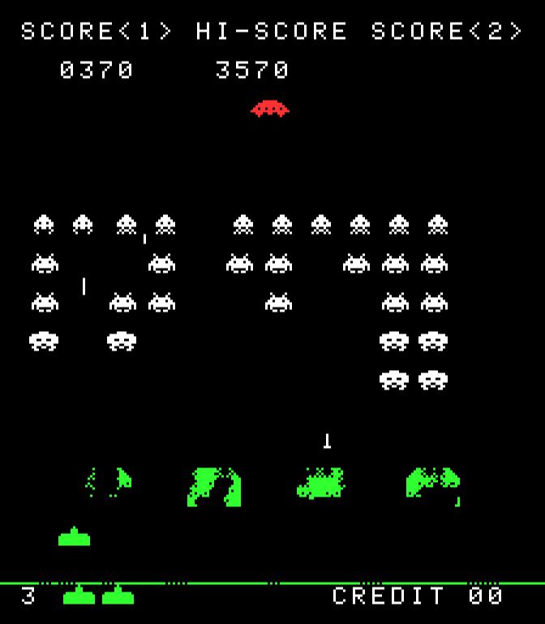

# Arcade Classics

Faithful recreations of classic arcade games, each in a single HTML file with no libraries. Their behaviour, timings and graphics come from the original ROMs wherever possible.

| Game | File | Original |
| --- | --- | --- |
| [Asteroids](#asteroids) | `asteroids.html` | Atari, 1979 |
| [Space Invaders](#space-invaders) | `invaders.html` | Taito, 1978 |

## Play

There's nothing to install or build. Open `asteroids.html` or `invaders.html` in any modern browser and press **Enter**.

You can also serve them locally:

```sh
python3 -m http.server
# then visit http://localhost:8000/asteroids.html or http://localhost:8000/invaders.html
```

Sound starts after your first key press, because browsers block audio until then.

## Asteroids

A faithful recreation of Atari's 1979 arcade *Asteroids* in a single HTML file, flying saucers included.


### Controls

| Key | Action |
| --- | --- |
| ← / → (or A / D) | Rotate |
| ↑ (or W) | Thrust |
| Space | Fire (one shot per press) |
| Shift | Hyperspace |
| Enter | Start |
| M | Sound on/off |

### Scoring

| Target | Points |
| --- | --- |
| Large rock | 20 |
| Medium rock | 50 |
| Small rock | 100 |
| Large saucer | 200 |
| Small saucer | 1,000 |

You start with 3 ships and earn an extra one every 10,000 points. The high score is saved in your browser.

### How close to the arcade is it?

**Taken from the arcade's own code** (via the ROM disassemblies listed under Sources):

- The vector shapes of the ship, thrust flame, four rock patterns, saucer and lettering
- Ship rotation, thrust, drag and top speed; shot speed and range; 4 shots on screen (2 for the saucer)
- Wave sizes (4, 6, 8, 10, then 11 large rocks), the 26-rock limit and the pause between waves
- Saucer timing. The gap between saucers shrinks with each appearance. While you're busy clearing rocks, the saucer holds off until only a few remain. Small saucers grow more likely over time, and from 30,000 points every saucer is small.
- Saucer aim. The large saucer fires at random. The small one aims at you, off by up to 22°, tightening to 11° from 35,000 points.
- Hyperspace has a 1-in-4 chance of destroying the ship on arrival, unless the screen is crowded with rocks
- Ramming a rock still scores it, and a new ship only appears once the centre of the screen is clear

**Approximated:**

- Rock speeds and hit sizes are matched by eye to arcade screenshots
- Sounds are synthesized in the browser to imitate the cabinet's heartbeat, shots, explosions, thrust, saucer siren and extra-ship chime

**Left out:** two-player mode, the high-score initials table and the arcade's score reset at 99,990.

### Code tour

Everything lives in `asteroids.html`: about 900 lines of plain JavaScript drawing on a `<canvas>`, with no libraries.

- The playfield uses the arcade's own 1024×768 vector coordinates, and the game advances in fixed 60 Hz steps like the original hardware. Speeds are in pixels per frame and timers in frames, so the constants at the top of the script can be compared directly with the ROM.
- The code is split into sections marked with `// --- NAME ---` comments: vector shapes, game state, controls, sound, helpers, game flow, ship, shots, rocks, saucer, explosions, collisions, game loop and rendering.
- Game state lives in top-level variables, so you can experiment from the browser console. For example, `score = 29990` puts you just short of all-small saucers, and `rockHitTimer = 0; saucerTimer = 1` summons a saucer right away.

### Sources

- [Computer Archeology: Asteroids vector ROM](https://computerarcheology.com/Arcade/Asteroids/VectorROM.html) and [game code disassembly](https://computerarcheology.com/Arcade/Asteroids/Code.html), commented by Lonnie Howell and Mark McDougall
- [6502disassembly.com: Asteroids](https://6502disassembly.com/va-asteroids/)
- [Asteroids on Wikipedia](https://en.wikipedia.org/wiki/Asteroids_(video_game))
- [ClassicGaming play guide](https://classicgaming.cc/classics/asteroids/play-guide)

## Space Invaders

A faithful recreation of Taito's 1978 arcade *Space Invaders*, as sold in the US by Midway, in a single HTML file, mystery saucer included.



### Controls

| Key | Action |
| --- | --- |
| ← / → (or A / D) | Move |
| Space | Fire (let go between shots) |
| Enter (or Space) | Start |
| M | Sound on/off |

### Scoring

| Target | Points |
| --- | --- |
| Octopus (bottom two rows) | 10 |
| Crab (middle two rows) | 20 |
| Squid (top row) | 30 |
| Mystery saucer | 50, 100, 150 or 300 |

You start with 3 cannons and earn one extra at 1,500 points. If the invaders reach your cannon's row, the game ends at once, however many cannons you have left. The high score is saved in your browser.

### How close to the arcade is it?

**Taken from the arcade's own code** (via the ROM disassembly listed under Sources):

- Every sprite, the shields and the lettering, byte for byte
- The screen works like the original's video memory: it's never wiped, and something has been hit when it's drawn onto pixels that are already lit. That's why shields crumble in the exact shape of each explosion, and why invaders wipe out shields as they pass over them.
- The rack redraws one invader per frame. That's where the famous speed-up comes from: a full rack takes 55 frames to move one step, and the last invader moves every frame (stepping 3 pixels to the right instead of 2). Also from the ROM: the 8-pixel drop at each edge, the starting height of each round, and the freeze while a hit invader explodes.
- The three kinds of bomb. The rolling bomb aims at the column above you, and the other two follow fixed tables of columns. Bombs reload faster as your score rises, move faster once 8 or fewer invaders remain, and the plunger bomb stops when only one invader is left.
- The saucer. It appears about every 25 seconds once the rack has dropped, but only while 8 or more invaders remain. The side it enters from and its score both depend on how many shots you've fired, so the famous trick works: it's worth 300 on your 23rd shot and every 15th after that.
- The cannon: one shot at a time, fire released between shots, the one-second explosion and the wait before the next cannon arrives
- The four-note march, which quickens using the ROM's own table and keeps its own time, separate from the rack
- Attract mode: the typed title, the score advance table and a demo game steered by the arcade's demo script
- The extra cannon at 1,500 points, and the four-digit score that rolls over after 9,999

**Approximated:**

- The red and green colour bands. On the cabinet they were strips of film over the screen, not part of the ROM. Their positions come from the MAME emulator's layout for the game, and real cabinets varied.
- Sounds are synthesized in the browser to imitate the cabinet's analogue circuits: the march, shots, explosions, saucer siren and extra-cannon chime
- The game runs at 60 frames per second; the original hardware ran slightly slower, at about 59.5

**Left out:** two-player mode, coins and the settings switches (it plays with the defaults: 3 cannons and an extra one at 1,500), the hidden "TAITO COP" message, a rare bug in the arcade's column arithmetic when the rack is far to the right, and the animated jokes in the arcade's alternate attract cycle, where an invader replaces the upside-down Y in "PLAY" and shoots the extra C out of "INSERT CCOIN".

### Code tour

Everything lives in `invaders.html`: about 1,250 lines of plain JavaScript drawing on a `<canvas>`, with no libraries.

- The screen is the arcade's own 224×256 pixels, held in a byte array that is never cleared. Each object erases its old image and draws its new one. `drawSprite` reports whether it landed on lit pixels, and that's the game's only collision test. Each frame, the array is coloured through the overlay bands and scaled up to fit the window.
- The game advances in fixed 60 Hz steps, running its tasks in the arcade's order: what the original did in its end-of-screen interrupt, then its mid-screen interrupt, then its main loop. Functions name the ROM routine they follow, like `// DrawAlien $0100`, so they can be compared with the disassembly. Speeds are in pixels per frame and timers in frames.
- The code is split into sections marked with `// --- NAME ---` comments: graphics, game state, controls, sound, helpers, screen, HUD, game flow, player, player shot, invaders, alien shots, saucer, attract mode, game loop and rendering.
- The screens around the game (attract mode, the start prompt and game over) are generator functions, where each `yield` waits one frame.
- Game state lives in top-level variables, so you can experiment from the browser console. For example, `shotCount = 22` makes your next shot worth 300 if it hits the saucer, and `saucer.start = true` calls a saucer as soon as no squiggly bomb is falling.
- The design notes, with a fact sheet of every value taken from the ROM and where it comes from, are in [`docs/superpowers/specs/`](docs/superpowers/specs/).

### Sources

- [Computer Archeology: Space Invaders](https://computerarcheology.com/Arcade/SpaceInvaders/): the commented [code disassembly](https://computerarcheology.com/Arcade/SpaceInvaders/Code.html), plus RAM and hardware notes
- MAME's [`invaders` driver](https://github.com/mamedev/mame/blob/master/src/mame/midw8080/mw8080bw.cpp) for the default settings, and its [layout file](https://github.com/mamedev/mame/blob/master/src/mame/layout/invaders.lay) for the colour overlay
- [Space Invaders on Wikipedia](https://en.wikipedia.org/wiki/Space_Invaders)

## Disclaimer

These are fan-made tributes. *Asteroids* is a trademark of Atari, and *Space Invaders* is a trademark of Taito. This project is not affiliated with or endorsed by either company, and on-screen text such as the "©1979 ATARI INC" line is part of the recreated arcade screens.
