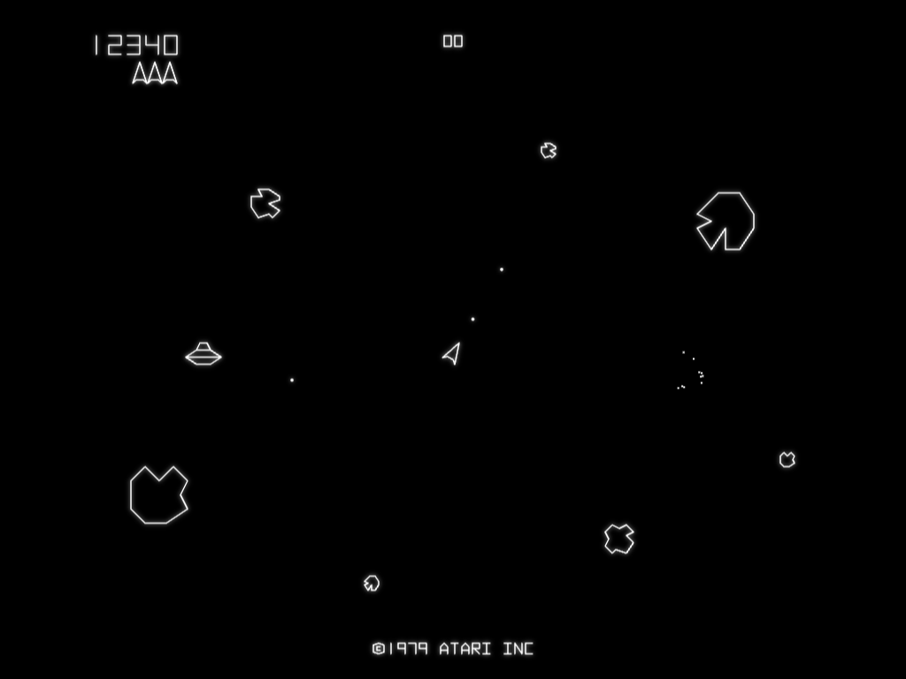

# Asteroids

A faithful recreation of Atari's 1979 arcade *Asteroids* in a single HTML file, flying saucers included.



## Play

There's nothing to install or build. Open `asteroids.html` in any modern browser and press **Enter**.

You can also serve it locally:

```sh
python3 -m http.server
# then visit http://localhost:8000/asteroids.html
```

### Controls

| Key | Action |
| --- | --- |
| ← / → (or A / D) | Rotate |
| ↑ (or W) | Thrust |
| Space | Fire (one shot per press) |
| Shift | Hyperspace |
| Enter | Start |
| M | Sound on/off |

Sound starts after your first key press, because browsers block audio until then.

### Scoring

| Target | Points |
| --- | --- |
| Large rock | 20 |
| Medium rock | 50 |
| Small rock | 100 |
| Large saucer | 200 |
| Small saucer | 1,000 |

You start with 3 ships and earn an extra one every 10,000 points. The high score is saved in your browser.

## How close to the arcade is it?

**Taken from the arcade's own code** (via the ROM disassemblies listed under Sources):

- The vector shapes of the ship, thrust flame, four rock patterns, saucer and lettering
- Ship rotation, thrust, drag and top speed; shot speed and range; 4 shots on screen (2 for the saucer)
- Wave sizes (4, 6, 8, 10, then 11 large rocks), the 26-rock limit and the pause between waves
- Saucer timing. The gap between saucers shrinks with each appearance. While you're busy clearing rocks, the saucer holds off until only a few remain. Small saucers grow more likely over time, and from 30,000 points every saucer is small.
- Saucer aim. The large saucer fires at random. The small one aims at you, off by up to 22°, tightening to 11° from 35,000 points.
- Hyperspace has a 1-in-4 chance of destroying the ship on arrival, unless the screen is crowded with rocks
- Ramming a rock still scores it, and a new ship only appears once the centre of the screen is clear

**Approximated:**

- Rock speeds and hit sizes are matched by eye to arcade screenshots
- Sounds are synthesized in the browser to imitate the cabinet's heartbeat, shots, explosions, thrust, saucer siren and extra-ship chime

**Left out:** two-player mode, the high-score initials table and the arcade's score reset at 99,990.

## Code tour

Everything lives in `asteroids.html`: about 900 lines of plain JavaScript drawing on a `<canvas>`, with no libraries.

- The playfield uses the arcade's own 1024×768 vector coordinates, and the game advances in fixed 60 Hz steps like the original hardware. Speeds are in pixels per frame and timers in frames, so the constants at the top of the script can be compared directly with the ROM.
- The code is split into sections marked with `// --- NAME ---` comments: vector shapes, game state, controls, sound, helpers, game flow, ship, shots, rocks, saucer, explosions, collisions, game loop and rendering.
- Game state lives in top-level variables, so you can experiment from the browser console. For example, `score = 29990` puts you just short of all-small saucers, and `rockHitTimer = 0; saucerTimer = 1` summons a saucer right away.

## Sources

- [Computer Archeology: Asteroids vector ROM](https://computerarcheology.com/Arcade/Asteroids/VectorROM.html) and [game code disassembly](https://computerarcheology.com/Arcade/Asteroids/Code.html), commented by Lonnie Howell and Mark McDougall
- [6502disassembly.com: Asteroids](https://6502disassembly.com/va-asteroids/)
- [Asteroids on Wikipedia](https://en.wikipedia.org/wiki/Asteroids_(video_game))
- [ClassicGaming play guide](https://classicgaming.cc/classics/asteroids/play-guide)

## Disclaimer

This is a fan-made tribute. *Asteroids* is a trademark of Atari. This project is not affiliated with or endorsed by Atari, and the "©1979 ATARI INC" line is part of the recreated arcade screen.
